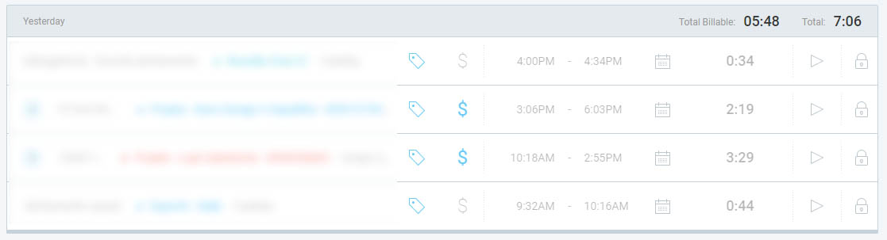

  
  
  <h1>ClockifyBy</h1>

  
A plugin to show billable hours in Clockify's Time Tracker page.

## Supported Browsers
- Chrome
- Opera - [need this plugin](https://addons.opera.com/en/extensions/details/install-chrome-extensions/)
